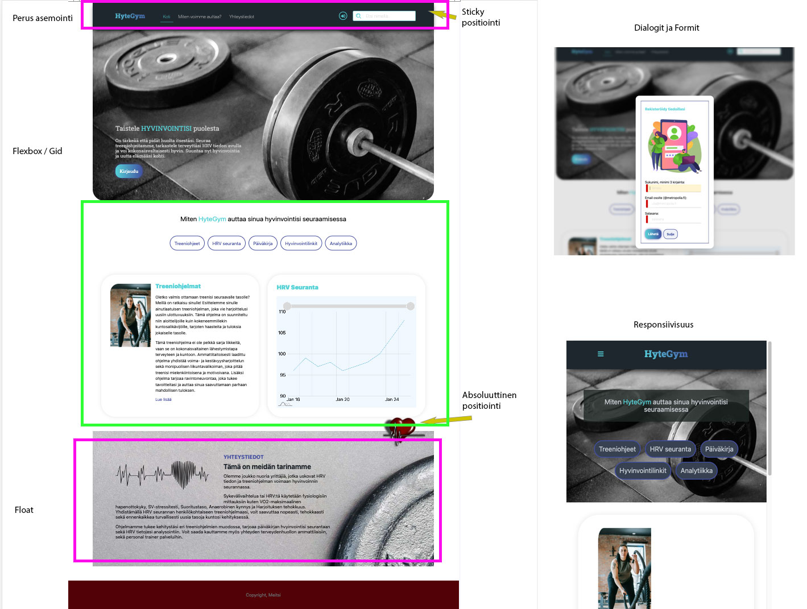
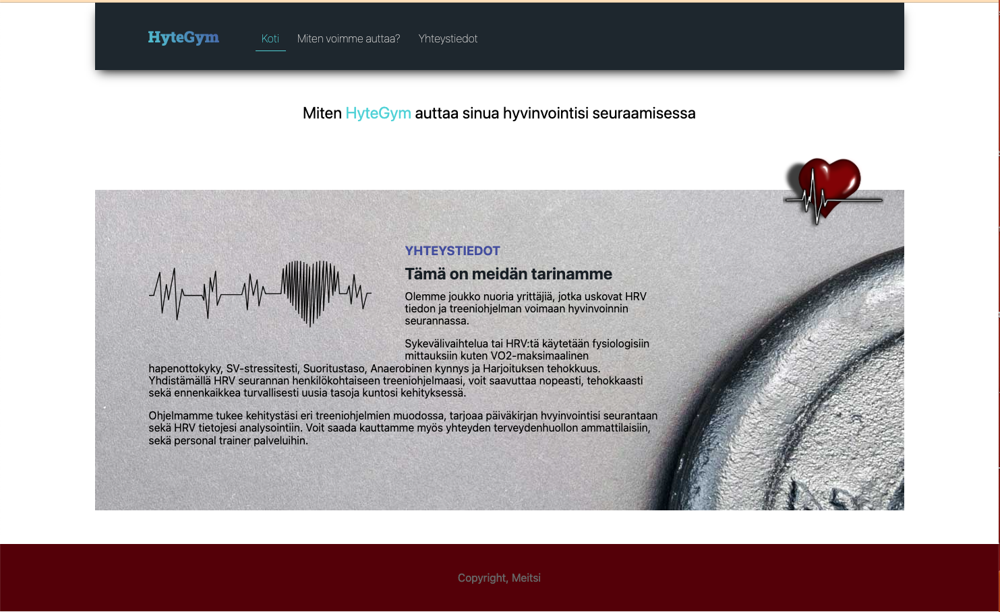

# Aasinsilta ensimmäisen vuoden web opintoihin

Ensimmäisen vuoden kursseilla harjoiteltiin Web puolen peruskonsepteja. Esim. mahdollisuuksia eri html elementtien asemointiin sivuilla on monia, ja tämä onkin usein hankalimpia CSS konsepteja hallita. Perustasolla, sinulla on käytettävissä seuraavat:

- block layout / inline layout
- elementtien koon määrittely (pikselit, prosentit, sisältöön mukauttaminen)
- box-sizing (margin, padding, border)
- kelluttaminen (floats)
- relatiivinen asemointi (relative positioning)
- absoluuttinen/ fiksattu asemointi (absolute / fixed positioning)
- keskittäminen (centering)

Ensimmäisenä päivänä harjoittelemme näitä asioita, löydät asemoinnin treenaamista varten, laatikko-harjoituspohjan täältä. Koodissa on mukana linkit asemoinnin eri käsitteisiin.

https://gist.github.com/UllaSe/ee995093047e953f0fa8cbb10ad564ac

Näitä osittain korvaamaan ja helpottamaan onkin suunniteltu Flexbox ja CSS Grid käsitteet. Flex ja Grid toimivat molemmat mukavasti yhdessä, kummallakin on kuitenkin oat käyttötarkoituksensa. Näihin syvennymme kunnolla seuraavien viikkojen aikana.

# 1. Tämän kurssin UI/UX tehtävien fokus, sivustoa jatketaan ja muutetaan useampi viikko

Haluatko paremmaksi Web Designeriksi? Yksi yllättävän yleinenkin tapa on kopioida ja luoda layout-kuvan mukaisia olemassa olevia sivuja. Lue ensin hieman ajatuksia täältä: https://css-tricks.com/excercise-to-get-better-at-web-design/

Inspiraatio tälle sivulle on saatu seuraavasta laytoutista. Näytän kuitenkin sivustosta toimivan demon.

https://dribbble.com/shots/23369008-Gym-Fitness-Landing-Page

Demosivun kuvankaappaus:

Koko kurssin aikana yritämme rakentaa tämän leiskan pohjalta mahdollisimman
identtisen ja ennen kaikkea toimivan, responsiivisen, tyylikkään sivuston hienovaraisilla animaatioilla ym.
Viemme viikko viikolta kurssilla leiskaa pidemmälle ja lisäämme toiminnallisuuksia sekä vaatimuksia sen tekemiseen. Joka viikko käymme läpi jotain tärkeää UI asemointia tai frontin konseptia tunneilla, jonka sinun on sitten rakennettava itse sivustoon.

Asioita joita mm. käsittelemme tällä kurssilla ja lopullisessa sivustossa on oltava:

- Käytetty kaikkia perus asemoinnin käsitteitä
- Semanttiset elementit ja niiden oikeanlainen hyödyntäminen
- CSS Flexbox / Grid pohja sivustossa ja sen käyttö muutenkin asemoinnissa
- CSS Reset ajatus
- Hyvin mietityt CSS luokat, määrittelyt ja nimeämiset
- Responsiivisuuden eri keinot ja sen tyylikäs toteuttaminen
- Täysin validoitu ja puhdas koodi
- Visuaalinen suunnittelu ja sen hyödyntäminen layoutissa
- Käytettävyyden perusteet
- Fonttien järkevä käyttö, Google tai paikallinen
- Modaalit, Dialogit
- Lomakkeet ja front-end validointi

Toisessa periodissa keskitymme projektin tekemiseen ja parannamme sivujen käyttökokemusta. Näistä lisää siis seuraavalla kurssilla.
 

# Tämän viikon varsinainen tehtävä, peruskäsitteet ja asemointi

Ensimmäisenä tehtävänä tällä viikolla on kerrata peruskäsitteitä. **Emme koske vielä flexbox/grid tyylittelyyn ensimmäisellä viikolla.** Tarkoitus onkin yrittää mimikoida jo olemassa olevaa designia ensin perinteisin keinoin. Ensimmäisellä viikolla saat siis käyttää kaikkea muuta, paitsi flexbox ja grid asemointia.

Navigaation ei ole tarkoitus toimia vielä, mutta on oltava tyylitelty. Luo siis näin alkuun vain yksi sivu. Mieti alkuun seuraavia, näitä emme siis vielä kaikkea toteuta tällä viikolla:

1. Miten ja mistä komponenteista rakentaisin itse sivuston tämän leiskan mukaiseksi?
2. Miten jaottelen leiskan sisällö eri alueisiin?
3. Mistä elementeistä navigaatio on tehty?

Jotta oppisimme tällä kurssilla uusia asioita, on sivuston teknologisiin ratkaisuihin tiukemmat kriteerit. Ensimmäisellä viikolla rakennamme sivustosta vai yhden osan. Lisäämme responsiivisuutta ja sisältöä seuraavilla viikolla, viikko kerrallaan.

### Ensimmäisen viikon tehtävänanto, UI

Ensimmäisellä viikolla saat käyttää siis vain perus asemointia, **ei flexbox, eikä grid asettelua**. Ensin teemme vain osan sivustosta. Aloitamme sivun about ja navigaatio-osuudesta. Huomaa, että sivujen pitää olla myös keskitetty.

Käytä sivuston esimerkki designia vain pohjana. Mieti oma hyvinvointiteemasi. Käytä vaihtoehtosia värejä sekä kuvia

## Tekniset vaatimukset

1. https://www.w3schools.com/css/css_navbar.asp
2. https://developer.mozilla.org/en-US/docs/Web/HTML/Element/nav

- Kirjoita HTML sekä CSS-koodi erillisiin tiedostoihin, jonka avulla luot sivustosi
- Opettele koodatessasi samalla Emmetin käyttöä
- Sykekuvan näkyvä harmaa osio on tehty css taustakuvana. Mikäli tämä on vielä hakusessa, käytä vain väriä.
- Saat tehtyä suorakulmaisista elementeistä ja reunuksista helposti pyöreitä/pyöristettyjä käyttämällä [border-radius määrittelyä](https://www.w3schools.com/cssref/css3_pr_border-radius.asp) [reunoja](https://www.w3schools.com/css/css_border.asp
- Jos haluat käyttää varjostusta, eli Box-shadow ominaisuutta:
  - [box-shadow](https://css-tricks.com/almanac/properties/b/box-shadow/)
  - [box-shadow w3schools](https://www.w3schools.com/cssref/css3_pr_box-shadow.asp)
- Käytä ylänavigaation linkeissä pseudoluokkia ja tekstille joku muutos kun hiiren osoitin on kohdistettu linkin päälle, sekä kun sitä painetaan (ja pidetään pohjassa)
  - [CSS Pseudo-classes](https://www.w3schools.com/css/css_pseudo_classes.asp)
- Muista hyvät nimeämiskäytännöt

Lisäämme seuraavilla viikolla sivulle mm. responsivisuuden, nämä voi jättää toistaiseksi pois.

## HTML ja CSS Validointi joka viikko käyttöön, samoin aloitamme LightHouse auditoinnin

Lighthouse auditointia ei tarvitse vielä tehdä, otamme sen seuraavilla viikoilla mukaan ja syvennämme auditointia syksyn aikana.

### HTML Validointi

Validointi, eli vahvistaminen on prosessi, jossa tarkistetaan, että prosessin kohde täyttää jotkin tietyt kriteerit. Kohde voi olla esimerkiksi tietokoneohjelma tai valmistusprosessi.

HTML validointi on käytännössä vähän samanlainen asia kun ESLintin käyttö. Kuten javascriptin, myös HTML-dokumentin kuuluu olla oikein muodostettu ja käyttökelpoinen.

Jotta kirjoittamamme koodi on standardin mukaista, on meidän ensin ymmärrettävä mitkä asiat muodostavat standardin

- HTML-koodihan on rakenteista tekstiä, joka muodostuu sisäkkäisistä ja perättäisistä elementeistä.
- Selaimet eivät näytä tunnisteita sellaisinaan vaan käsittelevät niitä teknisinä ohjeina, joiden mukaan sivun varsinainen sisältö tulee jäsentää.
- Oikeellisen dokumentin rakenne tarkastetaan dokumenttityypin mukaisesti.
- Dokumenttityyppi määrää muun muassa mitä elementtejä voi käyttää dokumentissa.
- Esim. HTML5 dokumenttityyppihän määritellään heti sivun alussa `<!DOCTYPE html>`
- Lue: https://www.w3schools.com/tags/tag_doctype.asp
- Dokumenttityyppi määrää myös mitkä elementit saavat sijaita minkäkin elementin sisällä ja mitä ominaisuuksia kuuluu millekin elementille.

World Wide Web Consortium, lyhyesti W3C on kansainvälinen yritysten ja yhteisöjen yhteenliittymä, joka ylläpitää ja kehittää WWW:n standardeja tai suosituksia kuten W3C niitä kutsuu. Uusimmat HTML standardit ja suositukset löydät täältä:

https://www.w3.org/standards/techs/html#w3c_all  

### HTML Validaattori

Validaattori on ohjelma, joka tarkastaa koneellisesti dokumentin oikeellisuuden dokumenttityypin mukaan.
W3C Markup validaattorin löydät täältä:

https://validator.w3.org/

No miksi aina kannattaa validoida? Hyviä pointteja löydät W3Cn sivuilta seuraavasta linkistä, lue tämä läpi:

https://validator.w3.org/docs/why.html
  

### 2. TEHTÄVÄ – Validoi HTML sivusi

Nyt kun olet lukenut HTML validoinnista, on aika myös käyttää validaattoria. Tehtävänäsi on validoida tekemäsi sivun koodi.

- Tarkista että html sivultasi löytyy dokumenttityyppi määriteltynä.
- Mene osoitteeseen: https://validator.w3.org/ ja validoi sivusi.
- Tarkista sekä korjaa mahdolliset virheet ja varoitukset:

Tässä esimerkissä minulta puuttuu div-elementin sulku ja validaattori kehoittaa lisäämään lang=”en” attribuutin html elementille, sillä käytän sivulla englantia, enkä muita kieliä. (https://www.w3.org/International/questions/qa-lang-why) Virhe 2 korjaantuu automaattisesti sillä, että korjaan virheen kohdassa kolme, eli lisään puuttuvan div-elementin.

Korjauksen jälkeen:

  

## 3. TEHTÄVÄ – Validoi myös CSS

Sama homma pätee myös CSS:n validointiin. Työkalun siihen löydät täältä:

https://jigsaw.w3.org/css-validator/

Validoi nyt sivusi CSS ja korjaa mahdolliset virheet.  
 
