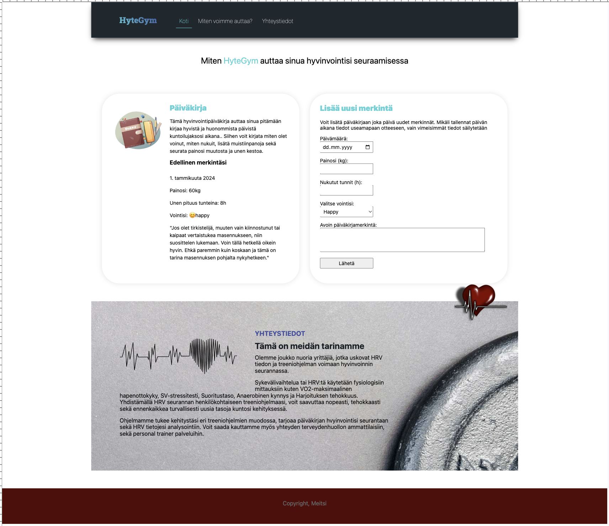

# BOM, DOM & Eventit

Kertaa materiaalia ensimmäisen vuoden kurssilta::

Osa 1: Bom ja Dom

1. [BOM & DOM](https://github.com/ilkkamtk/JavaScript-english/blob/main/BOM-DOM-event.md)
   - Käy läpi koko materiaali

## Bom ja Dom tehtävät:



### Tehtävä 1

Luo viime viikon sivupohjaasi uuden alueen, joka näyttää dynaamisesti käyttäjän selaimen ja laitteen tiedot käyttäen BOM:ia.

- [Browser Object Model](https://www.w3schools.com/js/js_window.asp)

Tulosta tiedot `#target` elementtiin. Voit asettaa jokaisen tiedon omalle `<p>` -elementilleen, ei kuitenkaan pakollista. Sivun tulisi näyttää yksityiskohdat kuten:

- Selaimen kieli

  - [Window navigator object](https://www.w3schools.com/jsref/obj_navigator.asp)

- Näytön leveys ja korkeus.

  - [Window Screen](https://www.w3schools.com/jsref/obj_screen.asp)

- Selaiminen tämänhetkinen näkyvän alueen (viewport) leveys ja korkeus

  - [Window object properties](https://www.w3schools.com/jsref/obj_window.asp)

- Nykyinen päivämäärä ja aika. Käytä suomalaista [localization](https://developer.mozilla.org/en-US/docs/Web/JavaScript/Reference/Global_Objects/Date/toLocaleDateString)

  - päivämäärän muoto: `1. helmikuuta 2056`
  - aika tuntien ja minuuttien tarkkuudella

### Tehtävä 2

Luo nyt vasemmanpuoleinen kortti. Voit tyylitellä sen oman maun mukaisesti. Lopputuloksen rakenteen tulisi olla seuraavanlainen:

```html
<h3>Edellinen merkintäsi</h3>
<div class="diary">
  <p class="date">1. tammikuuta 2024</p>
  <p>Painosi: <span class="weight">60</span>kg</p>
  <p>Unen pituus tunteina: <span class="sleepHours">8</span>h</p>
  <p>Vointisi: <span class="mood">😊 happy</span></p>
  <p class="diaryLog">
    "Jos olet tirkistelijä, muuten vain kiinnostunut tai kaipaat vertaistukea masennukseen, niin
    suosittelen lukemaan. Voin tällä hetkellä oikein hyvin. Ehkä paremmin kuin koskaan ja tämä on
    tarina masennuksen pohjalta nykyhetkeen."
  </p>
</div>
```

- huom: voit lisätä korttiin muotoiltua ja lisätietoa jotta se näyttää kivalta

### Tehtävä 3

Lisää sivuillesi `card.js` tiedosto. Lisää tiedoostoon seuraava javascipt tietorakenne:

```js
const diary = {
  date: '10. tammikuuta 2024',
  weight: '61',
  sleepHours: '7',
  mood: '😊 happy',
  diaryLog:
    'Jos olet tirkistelijä, muuten vain kiinnostunut tai kaipaat vertaistukea masennukseen, niin suosittelen lukemaan. Voin tällä hetkellä oikein hyvin. Ehkä paremmin kuin koskaan ja tämä on tarina masennuksen pohjalta nykyhetkeen.',
};
```

Lisää tarvittava js-koodi, jolla staattisten tietojen sijaan haet ja asetat kortin tiedot suoraan yllä olevasta tietorakenteesta. Esimerkki:

```js
let diaryDate = document.querySelector('.date');
diaryDate.innerHTML = diary.date;
```

## Eventit:

### Tehtävä 4

Rakenna nyt seuraavaksi oikeanpuoleinen kortti jossa on formi. Tähän korttiin ota selvää minkälaisia inpun kenttiä tarvitset sen tekemiseen. Lisää korttiin tarvittavat kentät ja halutesssi tyylittele se. Lisää tietoa ja apua täältä:

- [HTML Input types](https://www.w3schools.com/html/html_form_input_types.asp)
- [Option Tag](https://www.w3schools.com/tags/tag_option.asp)

### Tehtävä 5

Lisää form buttoniin tapahtumankuuntelija. Kun klikkaat lähetä nappia, hakee se formista kaikki kentät, tallentaa ne diary json tietorakenteeksi sekä näyttää uusimmat tiedot Päiväkirja kortissa.

- [Events and stoppind default action](https://github.com/ilkkamtk/JavaScript-english/blob/main/BOM-DOM-event.md#stopping-default-action-of-an-event)

### Tehtävä 6

Kun klikkaat lähetä nappulaa, käytä `alert` metodia ilmoittaaksesi käyttäjälle, että tiedot lisättiin. Lisää myös lähetä nappullaan tyylittelyä ja anna nappulalle `disabled` attribuutti joka estää käyttäjään uudelleen lähettämisen. Voit myös lisätä nappulalle tyylin, jotta se näyttää inaktiiviselta. Tee tämäkin hyödyntäen js tyylittelyä.
