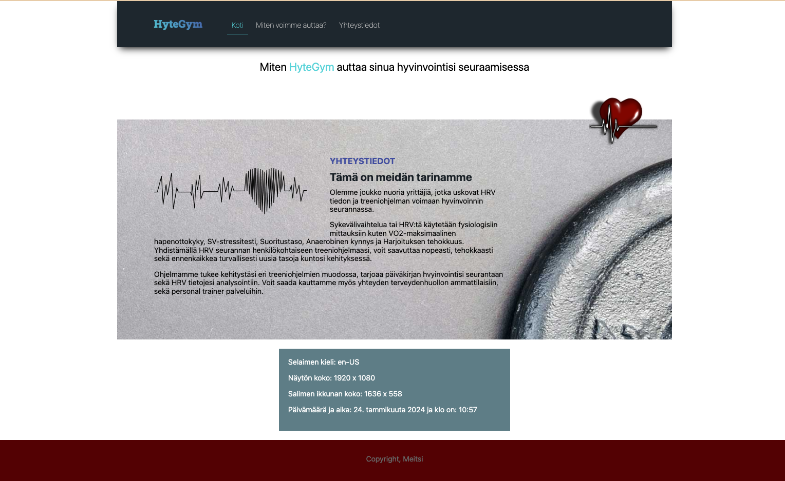
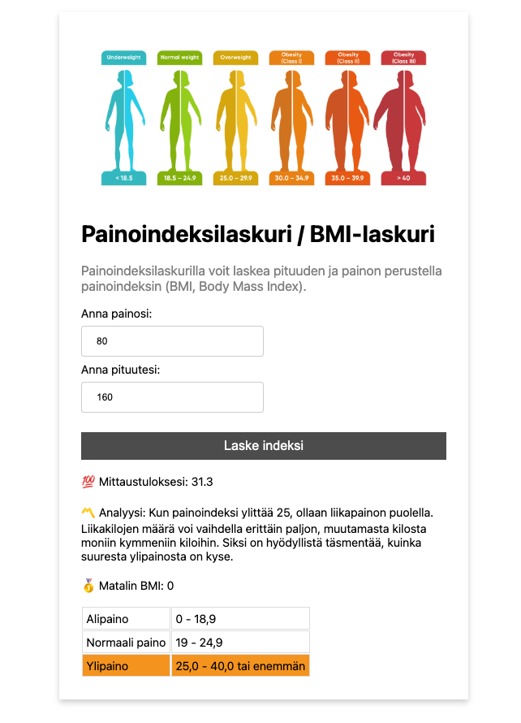

# BOM, DOM & Eventit

Kertaa materiaalia ensimmäisen vuoden kurssilta:

Bom, Dom ja Eventit

1. [BOM & DOM](https://github.com/ilkkamtk/JavaScript-english/blob/main/BOM-DOM-event.md)
   - Käy läpi koko materiaali

# Tehtävät viime viikon sivuston pohjaan

### Tehtävä 1

Asemoi viime viikon tehtävässä ja kuvassa näkyvä sydän (käytä omaa kuvaasi toki) absolute positiointia. Tähän materiaali edellisessä tehtävässä.



### Tehtävä 1.1 Extratehtävä (ei pakollinen)

Jos muistat miten js:n avulla luodaan html ja dom sisältöä, luo nyt staattisen html:n sijasta sivulla näkyvä asemoitu kuva käyttäen javascriptiä. Käymme tämän yhdessä läpi ensi viikon luennoilla.

### Tehtävä 2

Luo nyt sivupohjaasi vapaamuotoisesti sopivaan kohtaan uusi alue, joka näyttää dynaamisesti käyttäjän selaimen ja laitteen tietoja käyttäen BOM:ia.

- [Browser Object Model](https://www.w3schools.com/js/js_window.asp)

Tulosta tiedot `#target` elementtiin. Voit asettaa jokaisen tiedon esim. omalle `<p>` -elementilleen, ei kuitenkaan pakollista, käytä sivuusi sopivaa html elemettiä. Sivun tulisi näyttää seuraavat tiedot:

- Selaimen kieli

  - [Window navigator object](https://www.w3schools.com/jsref/obj_navigator.asp)

- Näytön leveys ja korkeus.

  - [Window Screen](https://www.w3schools.com/jsref/obj_screen.asp)

- Selaiminen leveys ja korkeus

  - [Window object properties](https://www.w3schools.com/jsref/obj_window.asp)

- Nykyinen päivämäärä ja aika. Ajan ei tarvitse olla dynaaminen/juokseva, vaan näytä aika kun sivusto avattiin. Käytä suomalaista muotoa [localization](https://developer.mozilla.org/en-US/docs/Web/JavaScript/Reference/Global_Objects/Date/toLocaleDateString)

  - päivämäärän muoto: `1. helmikuuta 2056`
  - aika tuntien ja minuuttien tarkkuudella

  # Tuntitehtävä - BMI Laskin

Teimme tunneilla yhdessä osoittain valmiiksi BMI laskurisivuston. Löydät tuntimateriaalit tästä reposta, kansiosta **valmiit-tuntiesimerkit**. Jatka nyt tunneilla tehtyä sivustoa. Tällä hetkellä sivusto ei värjää kaikkia BMI tuloksia talukossa ja mikäli syötät arvot uudestaan, se ei poista edellisiä taustavärejä. Tarvitset siis arvojen ja värien resetoinnin ennen uuden laskemista.

### Tehtävä 1

Tee loppuun funktiot:

```js
resettiFunktio();
bmiLaskuri(weight, height);
```

- sivuston täytyy toimia moitteetta. Kun käyttäjä syöttää arvot uudestaan, näyttää se aina uusimman tuloksen selkeästi
- esimerkkikoodissa on tarkoituksenmukaisesti toistoa, yritä siistiä ja yksinkertaistaa koodia mahdollisimman paljon. Muista siis DRY ajatus.


