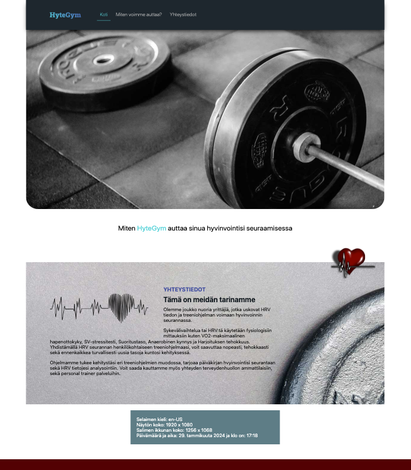
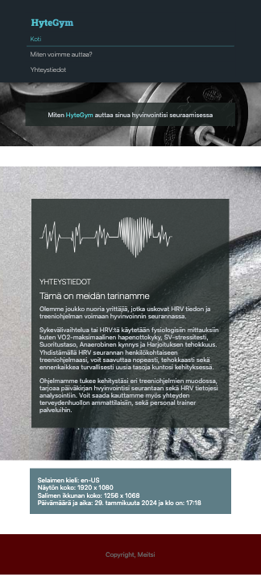

# Responsiivinen suunnittelu, perusteet

Käydään perusasiat ensin läpi luennon kautta:

1. [Responsiivinen suunnittelu](https://docs.google.com/presentation/d/1_lgctjnQ9ktsoBKFvkcBd43cN8EuTQ6IhVtmW6ttTss/edit?usp=sharing)

 

# Tehtävät sivuston pohjaan

### Tehtävä 1 - Responsiivinen Banner/Hero kuva

Lisää sivuillesi responsiivinen Banner/Hero kuva. Yritä tässä käyttää CSS Background ominaisuutta ja sovittaa kuva mahdollisimman mukautuvaksi alueeseen.

### Tehtävä 2 - Media Queries / Mediakyselyt

Lisää sivuillesi muutama breakpoint jossa muutat sisältöä sopimaan paremmin kyseiseen näyttökokoon. Joudut nyt katsomaan kokonaisuutta "content first" ajattelutavalla. Tee breakpointit niihin kohtiin, missä sisältö menee rikki tai tarvii korjailua.

- [Media Queries](https://www.w3schools.com/css/css_rwd_mediaqueries.asp)

Varmista että sisältösi mukautuu pieniin kokoihin. Tarkista että kuvat skaalaantuvat ja fontit mukautuvat sisällön mukaan. Varmista ettei sivu mene "rikki" missään vaiheessa.

Responsiivista navigaatiota (esim. burger menu) ei tarvitse vielä tehdä, mutta voit toteuttaa sen jos haluat. Varmista kuitenkin että navigaatio pienenee, menee vertikaalisesti tms. eikä mene rikki.

