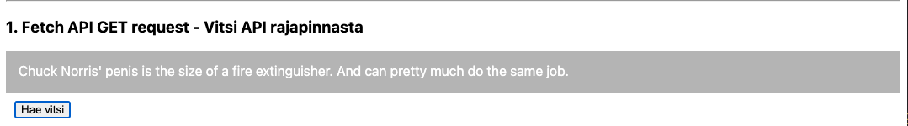
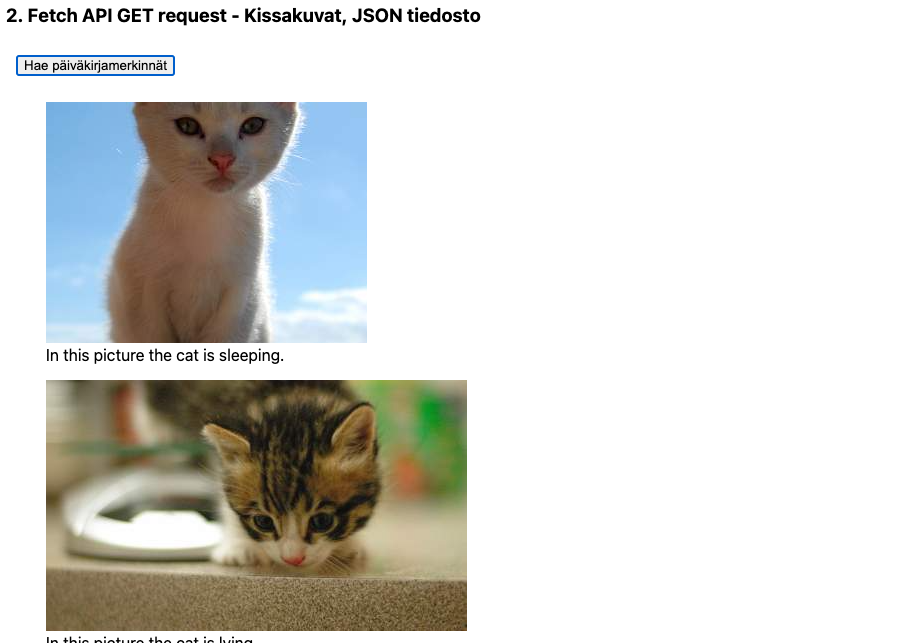
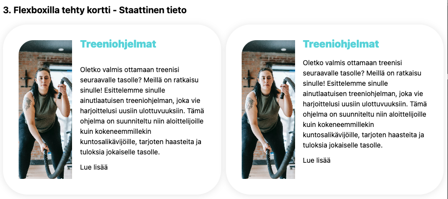
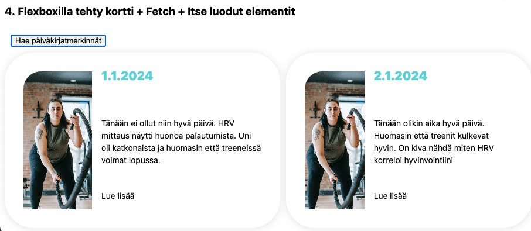

# Vite.js, fetch perusteet

Asennetaan ensin vite:

### Setting up Vite for front-end (client) development

[Vite](https://vitejs.dev/guide/)

1. Create a new project with Vite in terminal

   ```sh
   # cd to your code folder
   npm create vite@latest
   # 1. type your project name
   # 2. Select a framework: -> Vanilla
   # 3. Select a variant: -> Javascript
   cd <project-name>
   npm install
   # start vite dev server
   npm run dev
   ```

1. Open the preview URL in your browser and open developer tools
1. Open the project folder in VS Code
1. To get started with you own web app
   - edit or replace `index.html` file but do not remove `<script type="module" src="/main.js"></script>`
   - edit or replace `style.css` with your own styles
   - edit `main.js` file (note that the css file is imported in the js file instead of the html file `import './style.css';`). Everything else boilerplate code can be removed from the js file.

<br>

Ja konfiguroidaan Prettier, huom eri tiedosto kuin Matin materiaaleissa:

### [Prettier](https://prettier.io/)

- is a popular code formatter that helps ensure consistent code style across projects.
- automatically formats code based on a set of predefined rules, eliminating the need for manual formatting.
- supports various programming languages, including JavaScript, TypeScript, CSS, HTML, and more.
- enforces a consistent code style by handling tasks such as indentation, spacing, line breaks, and wrapping.
- provides configuration options to customize the formatting rules according to project requirements.
- helps maintain code readability and improves code maintainability by providing a consistent and clean codebase.

  ```javascript
  // sample .prettierrc.cjs
  /** @type {import("prettier").Config} */
  module.exports = {
    semi: true,
    singleQuote: true,
    bracketSpacing: false,
    singleQuote: true,
    trailingComma: 'es5',
  };

  module.exports = config;
  ```

# Fetch API

Apit Ajax

1. [Fetch API](https://github.com/ilkkamtk/JavaScript-english/blob/main/apit-ajax.md#fetch-api)
   - Käy läpi JSON ja Fetch API

Fetch API on moderni JavaScript-ohjelmointirajapinta, joka tarjoaa käyttöliittymän verkkopyyntöjen (esim. HTTP-pyyntöjen) tekemiseen web-selaimissa ja Node.js-ympäristöissä. Se on suunniteltu olemaan joustavampi ja tehokkaampi kuin vanhempi XMLHttpRequest.

Fetch API:lla on seuraavat keskeiset piirteet:

1. Yksinkertaisuus ja selkeys: Fetch API käyttää suoraviivaista ja Promisen perusteella toimivaa syntaksia, mikä helpottaa asynkronisten operaatioiden käsittelyä.

2. Promise-pohjainen: Fetch palauttaa Promisen, joka ratkeaa kyseiseen pyyntöön liittyvään Responseen, olipa se onnistunut tai ei.

3. Jäsennellymmät Request- ja Response-objektit: Fetch API esittelee jäsennellymmät Request- ja Response-objektit, mikä mahdollistaa pyyntöjen ja vastausten käsittelyn yhtenäisemmällä tavalla.

Tässä on yksinkertainen esimerkki Fetch API:n käytöstä GET-pyynnön tekemiseen:

```javascript
fetch('https://api.example.com/data')
  .then((response) => {
    if (!response.ok) {
      throw new Error('Verkkovastaus ei ollut kunnossa');
    }
    return response.json();
  })
  .then((data) => {
    console.log(data);
  })
  .catch((error) => {
    console.error('Fetch-operaatiossa ilmeni ongelma:', error);
  });
```

Tässä esimerkissä fetchData-funktio on määritelty async-funktioksi, joka käyttää await-komentoa Fetch API -pyyntöjen odottamiseen. fetch-kutsu odottaa pyynnön valmistumista, ja vastaus tallennetaan response-muuttujaan. Tämän jälkeen vastauksen tila tarkistetaan, ja jos se on virheellinen, heitetään virhe. Muussa tapauksessa vastauksen JSON-sisältö odotetaan ja tallennetaan data-muuttujaan, joka lopuksi kirjataan konsoliin. Virheet käsitellään try-catch-rakenteessa. fetchData-funktio kutsutaan sitten suorituksen aloittamiseksi.

# async + await

async ja await ovat JavaScriptin ominaisuuksia, jotka mahdollistavat asynkronisten toimintojen hallinnan ja selkeyttävät asynkronisen koodin kirjoittamista.

**async**: Avainsana, joka määrittelee funktion, joka palauttaa Promise-objektin. Funktion suoritus alkaa normaalisti, mutta mikäli funktiosta palautetaan arvo, se kääritään automaattisesti Promiseen. async-funktioissa voidaan käyttää await-avainsanaa odottamaan toisen async-funktion suorittamisen valmistumista.

**await\***: Avainsana, joka käytetään async-funktion sisällä odottamaan toisen asynkronisen toiminnon, kuten Promise-palauttavan funktion, suorittamisen valmistumista. await-avainsanalla merkitty operaatio "odottaa" sen valmistumista ennen kuin koodin suoritus jatkuu seuraavalla rivillä. await voidaan käyttää vain async-funktioiden sisällä.

Kun käytetään async ja await yhdessä, koodin rakenne muuttuu lineaarisemmaksi ja helpommin ymmärrettäväksi, kun verrataan perinteiseen Promise-pohjaiseen asynkronisen koodin kirjoitustapaan.

Esimerkki async-funktiosta ja await-avainsanan käytöstä:

```javascript
async function getData() {
  try {
    const response = await fetch('https://api.example.com/data');
    const data = await response.json();
    console.log(data);
  } catch (error) {
    console.error('Virhe:', error);
  }
}

getData();
```

Tässä esimerkissä getData on async-funktio, joka käyttää await-avainsanaa odottamaan Fetch API -pyynnön valmistumista ja vastauksen muunnosta JSON-muotoon. Virheiden käsittely tapahtuu try-catch -rakenteessa. Funktio getData kutsutaan sitten suorituksen aloittamiseksi.

### Tehtävä 1 - Hae Chuck Norris vitsi käyttäen yllä olevaa rakennetta

Rajapinnan ja ohjeet sen käyttöön löydät osoitteesta:

Luo seuraava rakenne html sivuillesi. Käytä Fetch, Async/Await, hae satunnainen vitsi ja tulosta se _show_joke_ diviin.

[Chuck Norris API](https://api.chucknorris.io/)

```html
<h3>1. Fetch API GET request - Vitsi API rajapinnasta</h3>

<div class="show_joke"></div>

<button class="chuck">Hae vitsi</button>
```



# DOM ja elementtien luominen

DOM (Document Object Model) on ohjelmointirajapinta, joka esittää dokumentin rakenteen HTML:ssä, XML:ssä tai XHTML:ssä, jotta ohjelmistot voivat muuttaa dokumentin sisältöä, rakennetta ja tyyliä. DOM kuvaa dokumentin kuin puurakenteen, jossa jokainen elementti on solmu.

Elementtien luominen DOM:ssa tarkoittaa uusien HTML- tai XML-elementtien luomista dynaamisesti JavaScriptillä. Tämä voi sisältää uusien elementtien luomisen tyhjästä, niiden muokkaamisen tai lisäämisen olemassa olevaan dokumenttiin. Elementtien luominen DOM:ssa on tärkeä osa dynaamisten verkkosivujen ja sovellusten kehittämistä, koska se mahdollistaa sisällön ja rakenteen luomisen ja muokkaamisen käyttäjän toiminnan perusteella.

1. [DOM](https://github.com/ilkkamtk/JavaScript-english/blob/main/BOM-DOM-event.md#document-interface)
   - Käy läpi DOM osuus ja elementtien luonti

### Tehtävä 2 - Kissakuvat

Hae ja tutki viime vuoden materiaaliesta esimerkki jossa sivuille luodaan kissakuvakortteja.

Muokataan hieman esimerkkiä:

1. Tallenne kuvat **pics.json** nimiseksi tiedostokseksi projektisi juureen.
2. Muokkaa esimerkkiä niin että koodissa ei muokata olemassa olevaa figure elementtiä, vaan Figure sekä muut elementit luodaan dynaamisesti javascriptin avulla
3. Mikäli json tiedostossa on useampi kissakuva, kuten tässäkin tapauksessa, käytetään taulukon forEach() -metodia jolla voidaan käydä taulukon jokainen alkio läpi ja luodaan kuva/kuvatieto jokaisesta kissasta

- [Creating DOM elements](https://www.w3schools.com/js/js_htmldom_nodes.asp)



### Tehtävä 3 - Kortit

Alla on kuvankaappaus kahdesta kortista. Korttien asemointi on tehty puhtaasti hyödyntäen Flexbox layout moduulia. Rakenna kaksi korttia hyödyntäen aamulla oppimaasi eli käyttäen Flexboksin ominaisuuksia. Voit käyttää omaa tekstiäsi ja otsikointia.

```html
<h3>3. Flexboxilla tehty kortti - Staattinen tieto</h3>

<section class="card-area">
  <!-- yksittäinen kortti -->
  <div class="card">
    <!-- vasen puoli jossa kuva -->
    <div class="card-img" id="trigger">
      
    </div>

    <!-- oikea puoli jossa päiväkirjamerkintä-->
    <div class="card-diary">
      <!-- tänne myös flexbox rakenne -->
    </div>
  </div>
</section>
```



### Tehtävä 4 - Flexboxilla tehty kortti + Fetch + Itse luodut elementit

Seuraavaksi yhdistä kaikki edellä opittu. Tallenna edellisen tehtäväsi korttien tekstisisältö **pics.json** tiedostoon. Rakenne voi olla esim. seurava. Käytä omaa tekstiäsi ja voit muuttaa json tiedoston rakennetta halutessasi:

```json
[
  {
    "day": "1.1.2024",
    "description": "Tänään ei ollut niin hyvä päivä. HRV mittaus näytti huonoa palautumista. Uni oli katkonaista ja huomasin että treeneissä voimat lopussa.",
    "address": "http://placekitten.com/321/241"
  },
  {
    "day": "2.1.2024",
    "description": "Tänään olikin aika hyvä päivä. Huomasin että treenit kulkevat hyvin. On kiva nähdä miten HRV korreloi hyvinvointiini",
    "address": "http://placekitten.com/421/251"
  }
]
```

Luo seuraavaksi edellisen tehtävän kortit käyttäen DOM elementtien luomista. Kortit on siis luotava kokonaan javascriptin avulla. Luo nappula jota klikkaamalla haet tiedot **diary.json** tiedostosta.

Vinkki: Tähän voit helposti käyttää chatgpt ym apureita. Anna toivottu html koodi ja pyydä tekoälyä kirjoittamaan elementtien luominen js:n avulla. Tarkista kuitenkin että generoitu koodi on järkevää.


