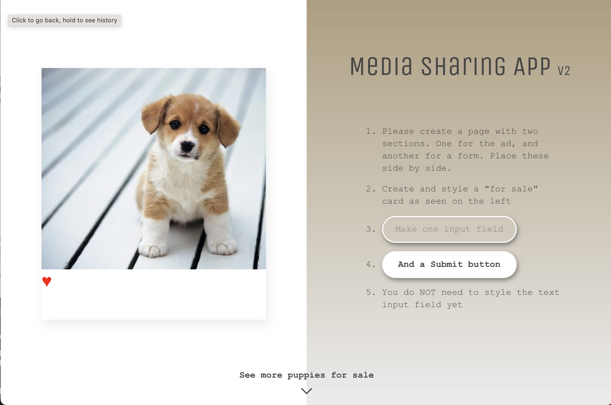

# Flexbox

Flexbox on CSS3:n osa, joka tarjoaa tehokkaan tavan järjestellä ja hallita elementtejä rivi- ja sarakemuodostelmissa joustavasti ja dynaamisesti. "Flexbox" tulee sanasta "Flexible Box", mikä kuvaa sen kykyä mukautua erilaisiin näyttökoon muutoksiin ja sisällön määriin. Flexbox on erityisen hyödyllinen silloin, kun halutaan luoda responsiivisia ja monipuolisia käyttöliittymiä verkkosivuille tai web-sovelluksiin.

Flexboxin avulla voit määrittää, miten elementit järjestellään, sijoitetaan, venytetään ja kutistetaan suhteessa toisiinsa ja niiden ympäristöön. Flexboxin pääperiaatteita ovat joustavuus, suhteellisuus ja helppokäyttöisyys verrattuna perinteisiin CSS-menetelmiin.

[Loistava Flexbox tietosivu : A Complete Guide to Flexbox](https://css-tricks.com/snippets/css/a-guide-to-flexbox/)

Joitakin tärkeitä käsitteitä ja ominaisuuksia Flexboxissa ovat:

**_Flex Container_**: Elementti, joka sisältää flex-item-elementtejä. Tämä määritellään asettamalla CSS-ominaisuus display: flex; tai display: inline-flex; elementille, jonka haluat toimivan flex-containerina.

**_Flex Items_**: Elementit, jotka ovat suora lapsia flex-containerista ja joihin Flexbox-ominaisuudet vaikuttavat. Ne asettuvat joustavasti flex-containerin sisällä.

**_Main Axis ja Cross Axis_**: Flexboxilla on kaksi pääakselia, pääakseli (main axis) ja poikkeusakseli (cross axis), jotka määritellään flex-containerin suuntaan (flex-direction). Pääakseli on oletuksena vaakasuora ja poikkeusakseli pystysuora.

**_Justify Content_**: Ominaisuus, joka määrittää flex-itemien sijoittelun pääakselin suunnassa flex-containerissa.

**_Align Items ja Align Content_**: Ominaisuudet, jotka määrittävät flex-itemien ja flex-containerin välistä sijoittelua poikkeusakselin suunnassa.

**_Flex Grow, Flex Shrink ja Flex Basis_**: Ominaisuudet, jotka määrittävät flex-itemien joustavuuden ja niiden käyttäytymisen suhteessa toisiinsa.

Flexbox tarjoaa monipuolisia mahdollisuuksia layoutien hallintaan ja on tullut yhdeksi tärkeimmistä työkaluista responsiivisen suunnittelun ja joustavien käyttöliittymien toteuttamisessa verkkokehityksessä.

Harjoittelemme näitä käsitteitä yhdessä, vanhan tutun asemointitehtävän avulla:

[Laatikkoleikki](tuntiesimerkit-pohjat/vk1-asemointi-pohja/asemointi.html)

Harjoittelemme tekemään vastaavanlaisen layoutin yhdessä:

