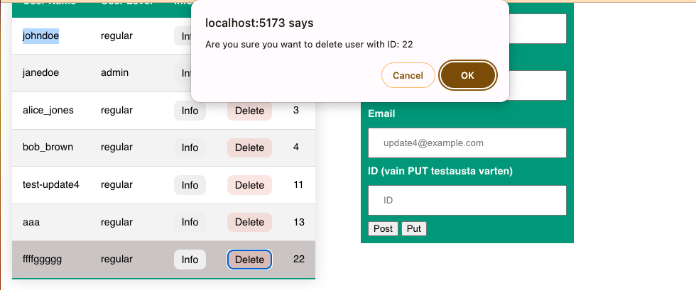

# Viikon 5 Fokus - Fetch Syventävä, Dialogit, Formit

Täällä viikolla keskitymme harjoittelemaan rajapintakutsuja. Teemme viime viikon tehtävät 1 ja 2 yhdessä. Viikkotehtävät 3 ja 4 jäävät kotitehtäviksi.

Hae tämän jälkeen sivujen harjoituspohja. Pohjaan haemme tietokannasta kaikki käyttäjät listana. Lisäämme sivustoon dialogin yksittäisiä käyttäjätietoja varten sekä rakennamme käyttäjien lisäystä/muokkaamista varten siihen sopivan formin.

### Viikon harjotustehtävä, alku


### Selektorit

Tarvitse monenlaisia uusi selektoreita seuraaviin tehtäviin. Käymme näit tuntien aika useampaa läpi. Jos tarvitset kertausta näihin, tutki seuraavaa linkkiä.

**Selectors**
https://www.w3schools.com/cssref/css_selectors.php

### CSS muuttujat

Vite on luonut meille projektiin valmiin css pohjan. Tutkimme alkuun hieman pohjaa ja CSS muuttujia. Muokkaa sivujasi niin että vaihdat vihreän perusvärin käyttämään CSS muuttujaa.

**CSS Variables**
https://www.w3schools.com/css/css3_variables.asp

### Data-attribuutti

Data-attribuutit ovat tapa sisällyttää lisätietoja HTML-elementtiin, jotka eivät vaikuta elementin ulkoasuun tai käyttäytymiseen suoraan, mutta jotka voivat olla hyödyllisiä JavaScriptin tai muiden ohjelmointikielten käytössä, jotka manipuloivat HTML-sivua dynaamisesti. Sivupohjassa näet taulukon buttoneissa data-id nimisen attribuutin.

```html
<td><button class="check" data-id="1">Info</button></td>
```

Attribuutteja voidaan käyttää JavaScriptissä tiedon hakemiseen, tarkasteluun tai dynamiseen muuttamiseen.

**HTML data- Attribute**
https://www.w3schools.com/tags/att_data-.asp

### Modaalit ja Dialogit

**Tutkitaan ensin perus Modaaleja**

https://www.w3schools.com/howto/howto_css_modals.asp

Modaalien kanssa on pereinteiseti ollut jonkunverran hankaluuksia, kuten tausta scroll. Näytän tästä tunnilla pari esimerkkiä. Modaaleja korvaamaan on lähivuosina kehitetty uusi html elemenentti **dialog** joka tarjoaa natiivin tuen modaaleille.

**Dialog**

https://developer.mozilla.org/en-US/docs/Web/HTML/Element/dialog

Käytämme tänään dialogin luomiseen valmista koodia hieman muunneltuna. Dialogin avaamiseen, kuten modaalien tarvitsen hippasen JS koodia. Katso alla oleve CodePen esimerkki.

- https://css-tricks.com/how-to-implement-and-style-the-dialog-element/
- Lue tämä myös tarkkaan: https://developer.mozilla.org/en-US/docs/Web/API/HTMLDialogElement

Lisätään Dialogille myös Backdrop ominaisuus.

- https://css-tricks.com/almanac/selectors/b/backdrop/ <br>
- https://codepen.io/chergav/pen/zYYbjaE
  <br>

## Rakennetaan ensin GET ja DELETE kutsut

Seuraa luentoa, käymme läpi sekä taulukkojen rakenteen, että itse FETCHin käytön. Kun painat nappulaa "Hae users tiedot" haetaan tiedot:

```http
# Get all users
GET http://127.0.0.1:3000/api/users
```

Haetuista tiedoista generoidaan taulukko dynaamisesti DOM metrodeilla ja jokaiselle taulukon jäsenelle generoidaan Info sekä Detele button-elementit. Button elementeille lisätään data-attribuuttina käyttäjän ID jatkokäsittelyä varten.

```html
<tr>
  <td>johndoe</td>
  <td>regular</td>
  <td><button class="check" data-id="1">Info</button></td>
  <td><button class="del" data-id="1">Delete</button></td>
  <td>1</td>
</tr>
```

```js
const td3 = document.createElement('td');
td3.innerHTML = `<button class="check" data-id="${log.user_id}">Info</button>`;
td3.addEventListener('click', getOneUserDialog);
tr.appendChild(td3);
```


Kun Info nappulaa klikkaa, hakee ohjelma tiedot käyttäen yksittäisen käyttäjän reittiä ja avaa yksittäisen käyttäjän tiedot dialogina. Tarvittavan ID:n hakuun se saa data-atrribuuti tiedoista.

```http
# Get user by id
GET http://127.0.0.1:3000/api/users/:id
```

Koodiesimerkki:

```js
async function getOneUserDialog(evt) {
  // haetaan data-attribuutin avulla id, tämä nopea tapa
  const id = evt.target.attributes['data-id'].value;
  console.log(id);
  const url = `http://127.0.0.1:3000/api/users/${id}`;
  try {
    const data = await fetchData(url);
    // avaa modaali ja lisää data
  ...
```

Kuvankappaaus:


Elementin poistamista varten käytämme confirm() metodia jolla varmistamme, että käyttäjä ei vahingossa poista tietoja.

[confirm](https://github.com/ilkkamtk/JavaScript-english/blob/main/BOM-DOM-event.md#confirm)

```http
# Delete user
DELETE http://127.0.0.1:3000/users/:id
```

Kuvankaappaus:


Seuraavaksi luomme oikealla näkyvän formin. Lähettämällä formin, voimme käyttää POST ja PUT reittejä, joilla lisäämme käyttäjän tai muokkaamme olemassa olevaa. Alla on lisää tietoja formien käytöstä.

```http
# Create user
POST http://127.0.0.1:3000/users
content-type: application/json

{
  "username": "test-update4",
  "password": "test-pw-update4",
  "email": "update4@example.com"
}

# Update user
PUT http://127.0.0.1:3000/users/:id
content-type: application/json

{
  "username": "test-update4",
  "password": "test-pw-update4",
  "email": "update4@example.com"
}
```

Tutki täältä formien lähettämistä:

[kohdasta Promise](https://github.com/ilkkamtk/JavaScript-english/blob/main/apit-ajax.md#promise)

## HTML5 lomakkeet ja validointi

HTML5-lomakkeet ovat osa HTML5-standardia, ja ne tarjoavat kehittyneitä tapoja luoda ja hallita interaktiivisia lomakkeita verkkosivuilla. Ne mahdollistavat käyttäjien tietojen syöttämisen ja lähettämisen palvelimelle sekä tarjoavat käytännöllisiä ominaisuuksia, kuten tietojen validointi ja selainpuolella tapahtuva tarkistus.

HTML5-lomakkeet sisältävät erilaisia lomake-elementtejä, kuten tekstikenttiä, salasanakenttiä, valintanappeja, pudotusvalikoita ja muita. Niiden avulla käyttäjät voivat syöttää erilaisia tietoja, kuten tekstiä, numeroita, päivämääriä, sähköpostiosoitteita ja muita tietotyyppejä.

[Forms](https://developer.mozilla.org/en-US/docs/Web/HTML/Element/form)

- **Tietojen validointi:** HTML5-lomakkeet tarjoavat mahdollisuuden asettaa validointiehtoja suoraan lomakekenttiin. Esimerkiksi voit määrittää, että sähköpostiosoitteen on oltava oikean muotoinen tai että tiettyjä kenttiä ei saa jättää tyhjiksi.

- **Tyylikäs käyttöliittymä:** HTML5-lomakkeet voivat sisältää uusia käyttöliittymäelementtejä, kuten kalenterin, värivalitsimen ja aikavalitsimen. Tämä tekee lomakkeista visuaalisesti houkuttelevampia ja käyttäjäystävällisempiä.

- **Tallentaminen selaimessa:** HTML5-lomakkeet voivat tallentaa osan käyttäjän syöttämistä tiedoista selaimen muistiin väliaikaisesti. Tämä voi auttaa käyttäjiä välttämään tietojen menetyksen esimerkiksi sivun päivittämisen tai vahingossa sivulta poistumisen yhteydessä.

Lomakkeita voi tyylitellä suhteellisen helposti, tosin osa, kuten radio-button kentät ovat hieman haastteellisempia. Useimmiten tyyylittelyyn käytetään myös **:valid** ja **:invalid** pseudoluokkia.
https://www.w3schools.com/css/css_form.asp

**_Teemme hiihtoloman jälkeen formien tyylittelyn sekä validointia, jolla tarkastamme kenttien oikeellisuuden._**

https://developer.mozilla.org/en-US/docs/Learn/Forms/Form_validation
