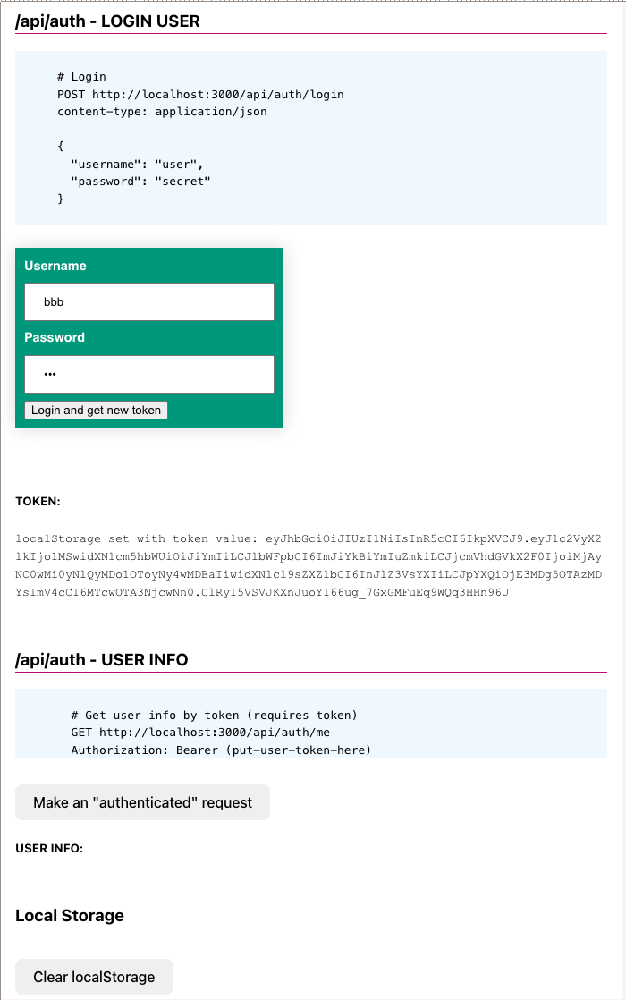
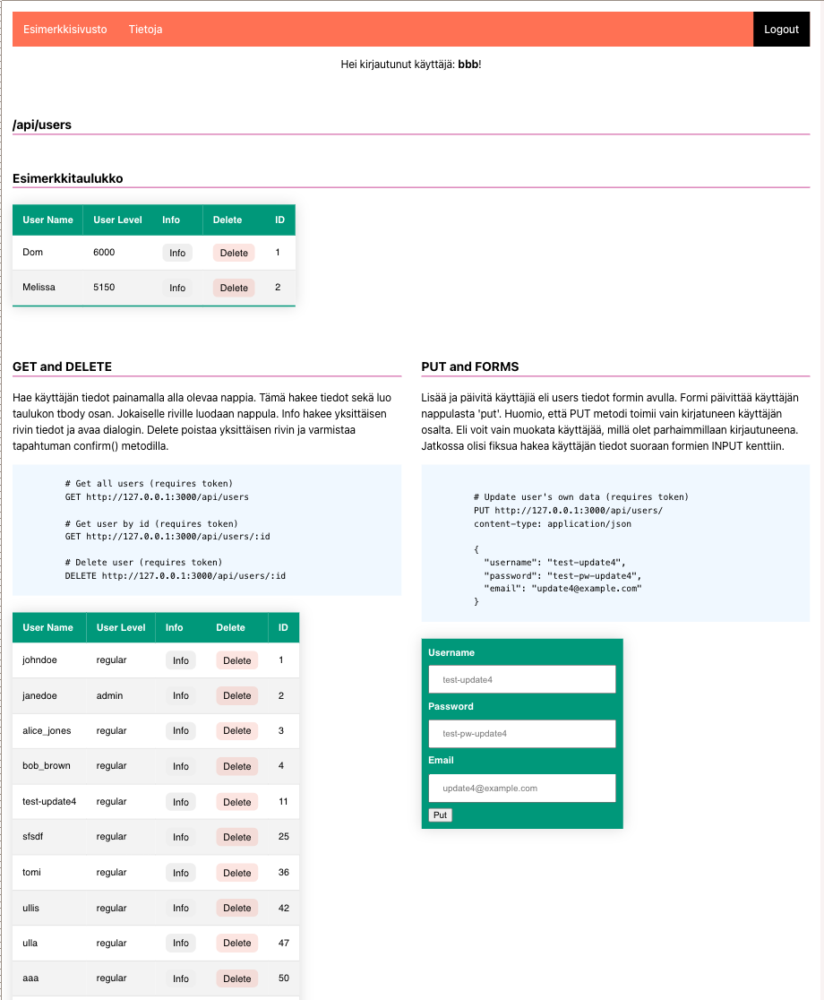
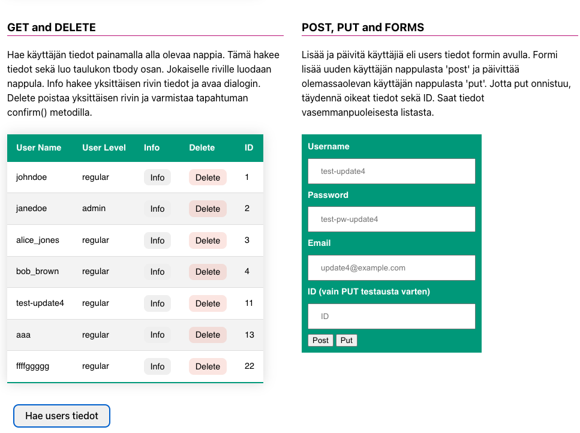
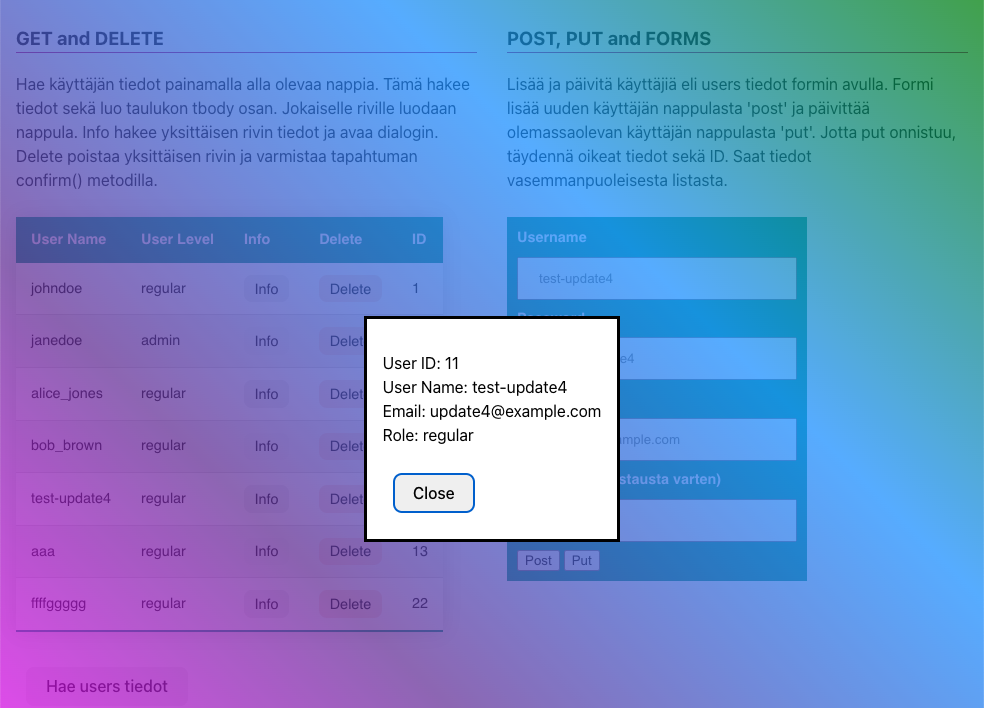
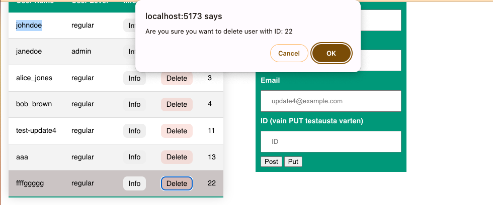

# Viikon 6 Fokus - API rajapintatestaus, Fetch Syventävä, Dialogit, Formit

Täällä viikolla keskitymme harjoittelemaan rajapintakutsuja. Tarvitset kaksi eriliasta pohjaa, hae tiedostot vk6-apikutsut-pohja kansiosta.

Ensimmäisen start-auth.html pohjaan harjoittelemme sisäänkirjatumista sekä tokenien käyttöä. start-apiharjoituspohja.html sivupohjaan haemme tietokannasta kaikki käyttäjät listana. Lisäämme tähän sivustoon myös dialogin yksittäisiä käyttäjätietoja varten sekä rakennamme käyttäjien muokkaamista varten siihen sopivan formin.

## Viikon harjotustehtävä, alku - Autentikaatio sekä Tokenit

Avaa ensin start-auth.html sivu. Näet sivustossa kaksi erilaista formia. Tutkimme ensin himen koodia, jonka jälkeen toteutamme formien avulla sisäänkirjatumisen.

JWT (JSON Web Token) autentikaatio on menetelmä, joka mahdollistaa turvallisen ja tehokkaan käyttäjän tunnistamisen ja valtuuttamisen web-sovelluksissa ja REST-rajapinnoissa. Se perustuu tokenien käyttöön, jotka ovat pieniä datayksiköitä, jotka sisältävät tietoja käyttäjän tunnistamiseksi ja valtuuttamiseksi. JWT-avainta käytetään usein lähettämään käyttäjän tunnistetietoja, kuten käyttäjätunnus ja rooli, ja se voi myös sisältää muita metatietoja. JWT:t ovat turvallisia, koska ne ovat allekirjoitettuja, mikä tarkoittaa, että niiden alkuperä voidaan varmistaa ja tietoja ei voi muuttaa ilman avainta. REST-rajapinnoissa JWT-tokenit usein välitetään HTTP-otsakkeiden kautta pyyntöjen autentikoimiseksi ja käyttöoikeuksien varmistamiseksi.

JWT-tokenit voidaan lähettää HTTP-pyynnön otsakkeissa. Yleisimmin käytetty otsake on Authorization, joka sisältää JWT-tokenin. Esimerkiksi:

```javacript
Authorization: Bearer <JWT-tokeni>

```

JWT-tokenin vastaanottaminen tapahtuu vastaavasti. Sovellus tarkistaa saapuvan pyynnön otsakkeista, evästeistä tai pyyntöparametreista JWT-tokenin, joka sisältää tarvittavat käyttäjän tunnistetiedot ja käyttöoikeudet. Sen jälkeen sovellus voi tarkistaa tokenin aitouden ja käyttöoikeudet sen allekirjoituksen avulla. Jos tokeni on validi, sovellus voi antaa käyttäjälle pääsyn pyydettyyn toiminnallisuuteen tai resursseihin.



### Tokenien tallentaminen

Paras tapa tallentaa JWT (JSON Web Token) -autentikointitunniste frontendissä riippuu tarkoituksistasi ja turvallisuusnäkökohdista. Tässä muutamia yleisiä menetelmiä:

- Selaimen evästeet

- Paikallinen tallennustila (Local Storage) tai sessiotallennustila (Session Storage). Käytä localStoragea pysyvään tallennukseen yli selainistuntojen ja sessionStoragea istunto-kohtaiseen tallennukseen.

- Muistivarasto: Tallenna JWT-tunniste muistiin käyttämällä JavaScript-muuttujia. Vaikka tämä menetelmä voi olla turvallinen, se vaatii huolellista hallintaa varmistaaksesi, ettei tunniste vuoda XSS-hyökkäysten kautta.

- IndexedDB: Tallenna JWT-tunniste selainmen omaan tietokantaan.

Jokaisella menetelmällä on omat etunsa ja haittansa turvallisuuden, toteutuksen helppouden ja yhteensopivuuden suhteen eri käyttötapausten kanssa. Harkitse sovelluksesi vaatimuksia ja turvallisuustarpeita valitessasi sopivan tavan tallentaa JWT-tunnisteet frontendissä. Kurssilla käytämme LocalStoragea.

## Viikon harjoitustehtävä, loppu - kirjaantuneen käyttäjän apikutsut ja niiden käsittely



### Selektorit

Tarvitse monenlaisia uusi selektoreita seuraaviin tehtäviin. Käymme näit tuntien aika useampaa läpi. Jos tarvitset kertausta näihin, tutki seuraavaa linkkiä.

**Selectors**
https://www.w3schools.com/cssref/css_selectors.php

### CSS muuttujat

Vite on luonut meille projektiin valmiin css pohjan. Tutkimme alkuun hieman pohjaa ja CSS muuttujia. Muokkaa sivujasi niin että vaihdat vihreän perusvärin käyttämään CSS muuttujaa.

**CSS Variables**
https://www.w3schools.com/css/css3_variables.asp

### Data-attribuutti

Data-attribuutit ovat tapa sisällyttää lisätietoja HTML-elementtiin, jotka eivät vaikuta elementin ulkoasuun tai käyttäytymiseen suoraan, mutta jotka voivat olla hyödyllisiä JavaScriptin tai muiden ohjelmointikielten käytössä, jotka manipuloivat HTML-sivua dynaamisesti. Sivupohjassa näet taulukon buttoneissa data-id nimisen attribuutin.

```html
<td><button class="check" data-id="1">Info</button></td>
```

Attribuutteja voidaan käyttää JavaScriptissä tiedon hakemiseen, tarkasteluun tai dynamiseen muuttamiseen.

**HTML data- Attribute**
https://www.w3schools.com/tags/att_data-.asp

### Modaalit ja Dialogit

**Tutkitaan ensin perus Modaaleja**

https://www.w3schools.com/howto/howto_css_modals.asp

Modaalien kanssa on pereinteiseti ollut jonkunverran hankaluuksia, kuten tausta scroll. Näytän tästä tunnilla pari esimerkkiä. Modaaleja korvaamaan on lähivuosina kehitetty uusi html elemenentti **dialog** joka tarjoaa natiivin tuen modaaleille.

**Dialog**

https://developer.mozilla.org/en-US/docs/Web/HTML/Element/dialog

Käytämme tänään dialogin luomiseen valmista koodia hieman muunneltuna. Dialogin avaamiseen, kuten modaalien tarvitsen hippasen JS koodia. Katso alla oleve CodePen esimerkki.

- https://css-tricks.com/how-to-implement-and-style-the-dialog-element/
- Lue tämä myös tarkkaan: https://developer.mozilla.org/en-US/docs/Web/API/HTMLDialogElement

Lisätään Dialogille myös Backdrop ominaisuus.

- https://css-tricks.com/almanac/selectors/b/backdrop/ <br>
- https://codepen.io/chergav/pen/zYYbjaE
  <br>

## Rakennetaan ensin GET ja DELETE kutsut

Seuraa luentoa, käymme läpi sekä taulukkojen rakenteen, että itse FETCHin käytön. Kun painat nappulaa "Hae users tiedot" haetaan tiedot:

```http
# Get all users (requires token)
  GET http://127.0.0.1:3000/api/users
```

Haetuista tiedoista generoidaan taulukko dynaamisesti DOM metodeilla ja jokaiselle taulukon jäsenelle generoidaan Info sekä Detele button-elementit. Button elementeille lisätään data-attribuuttina käyttäjän ID jatkokäsittelyä varten.

```html
<tr>
  <td>johndoe</td>
  <td>regular</td>
  <td><button class="check" data-id="1">Info</button></td>
  <td><button class="del" data-id="1">Delete</button></td>
  <td>1</td>
</tr>
```

```js
const td3 = document.createElement('td');
td3.innerHTML = `<button class="check" data-id="${log.user_id}">Info</button>`;
td3.addEventListener('click', getOneUserDialog);
tr.appendChild(td3);
```



Kun Info nappulaa klikkaa, hakee ohjelma tiedot käyttäen yksittäisen käyttäjän reittiä ja avaa yksittäisen käyttäjän tiedot dialogina. Tarvittavan ID:n hakuun se saa data-atrribuuti tiedoista.

```http
# Get user by id (requires token)
  GET http://127.0.0.1:3000/api/users/:id
```

Koodiesimerkki:

```js
async function getUser(evt) {
  // haetaan data-attribuutin avulla id, tämä nopea tapa
  const id = evt.target.attributes['data-id'].value;
  console.log('Getting individual data for ID:', id);
  const url = `http://127.0.0.1:3000/api/users/${id}`;
  let token = localStorage.getItem('token');
  const options = {
    method: 'GET',
    headers: {
      Authorization: 'Bearer: ' + token,
    },
  };
  fetchData(url, options).then((data) => {
    console.log(data);
    // Avaa modaali/dialogi ja generoi data
  ...
```

Kuvankappaaus:



Elementin poistamista varten käytämme confirm() metodia jolla varmistamme, että käyttäjä ei vahingossa poista tietoja.

[confirm](https://github.com/ilkkamtk/JavaScript-english/blob/main/BOM-DOM-event.md#confirm)

```http
# Delete user (requires token)
  DELETE http://127.0.0.1:3000/api/users/:id
```

Kuvankaappaus:


Tutki täältä formien lähettämistä:

[kohdasta Promise](https://github.com/ilkkamtk/JavaScript-english/blob/main/apit-ajax.md#promise)

## HTML5 lomakkeet ja validointi

HTML5-lomakkeet ovat osa HTML5-standardia, ja ne tarjoavat kehittyneitä tapoja luoda ja hallita interaktiivisia lomakkeita verkkosivuilla. Ne mahdollistavat käyttäjien tietojen syöttämisen ja lähettämisen palvelimelle sekä tarjoavat käytännöllisiä ominaisuuksia, kuten tietojen validointi ja selainpuolella tapahtuva tarkistus.

HTML5-lomakkeet sisältävät erilaisia lomake-elementtejä, kuten tekstikenttiä, salasanakenttiä, valintanappeja, pudotusvalikoita ja muita. Niiden avulla käyttäjät voivat syöttää erilaisia tietoja, kuten tekstiä, numeroita, päivämääriä, sähköpostiosoitteita ja muita tietotyyppejä.

[Forms](https://developer.mozilla.org/en-US/docs/Web/HTML/Element/form)

- **Tietojen validointi:** HTML5-lomakkeet tarjoavat mahdollisuuden asettaa validointiehtoja suoraan lomakekenttiin. Esimerkiksi voit määrittää, että sähköpostiosoitteen on oltava oikean muotoinen tai että tiettyjä kenttiä ei saa jättää tyhjiksi.

- **Tyylikäs käyttöliittymä:** HTML5-lomakkeet voivat sisältää uusia käyttöliittymäelementtejä, kuten kalenterin, värivalitsimen ja aikavalitsimen. Tämä tekee lomakkeista visuaalisesti houkuttelevampia ja käyttäjäystävällisempiä.

- **Tallentaminen selaimessa:** HTML5-lomakkeet voivat tallentaa osan käyttäjän syöttämistä tiedoista selaimen muistiin väliaikaisesti. Tämä voi auttaa käyttäjiä välttämään tietojen menetyksen esimerkiksi sivun päivittämisen tai vahingossa sivulta poistumisen yhteydessä.

Lomakkeita voi tyylitellä suhteellisen helposti, tosin osa, kuten radio-button kentät ovat hieman haastteellisempia. Useimmiten tyyylittelyyn käytetään myös **:valid** ja **:invalid** pseudoluokkia.
https://www.w3schools.com/css/css_form.asp

**_Formien tyylittelyn sekä valdointi videoluennoilla_**

https://developer.mozilla.org/en-US/docs/Learn/Forms/Form_validation

## Viikon kotiehtävä - kirjaantuneen käyttäjän omien tietojen muokkaaminen

Luo kohdassa PUT and FORMS näkyvän formii. Lähettämällä formin, käytä PUT reittiä, jolla muokkaat olemassa olevaa käyttäjää. Kun muokkaus onnistuu, voit tulostaa tiedon konsoliin.

```http

# Update user
PUT http://127.0.0.1:3000/api/users/:id
content-type: application/json

{
  "username": "test-update4",
  "password": "test-pw-update4",
  "email": "update4@example.com"
}
```
